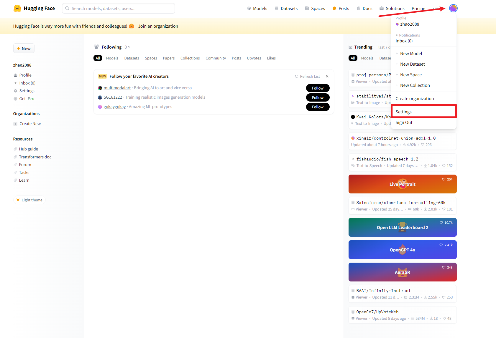
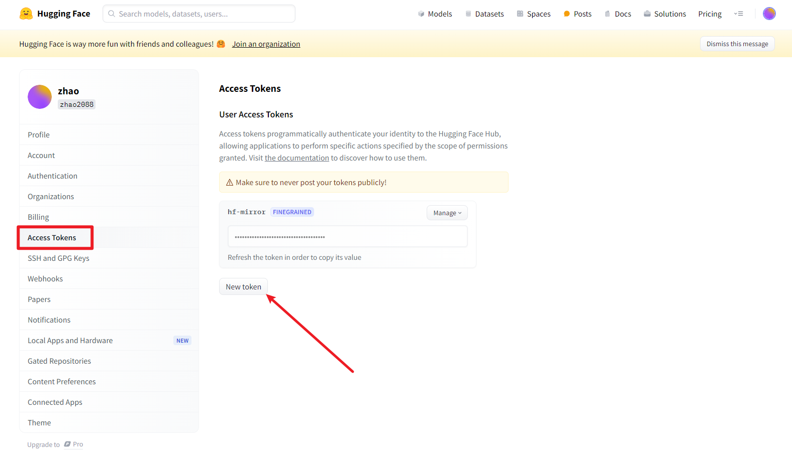
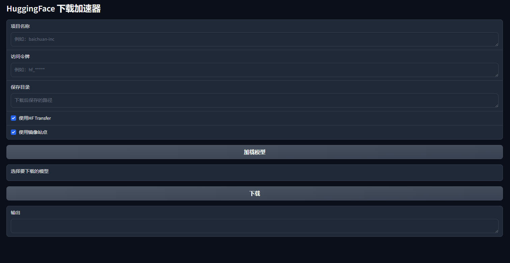
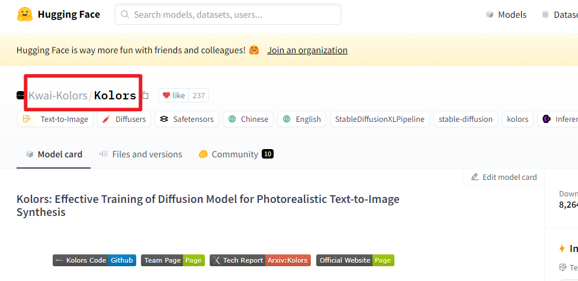
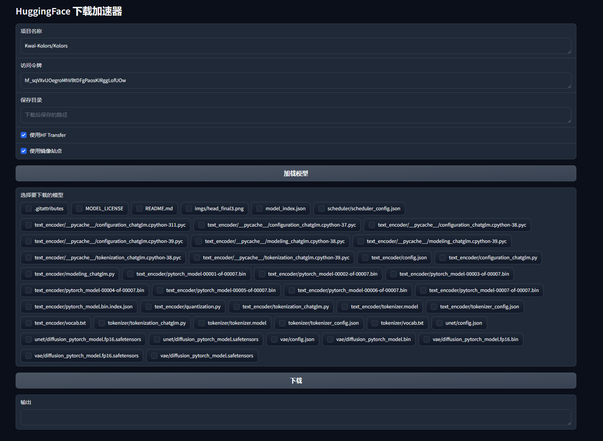

# 国内用户 HuggingFace 高速下载

利用 HuggingFace 官方的下载工具 [huggingface-cli](https://huggingface.co/docs/huggingface_hub/guides/download#download-from-the-cli) 和 [hf_transfer](https://github.com/huggingface/hf_transfer) 从 [HuggingFace 镜像站](https://hf-mirror.com/)上对模型和数据集进行高速下载。

---

## Usage

### 提示
本代码是参照大佬@Xiaojian Yuan的思路做了优化和改进而来。

参照代码：https://github.com/LetheSec/HuggingFace-Download-Accelerator
原本是一个基于命令来下载hugginFace的模型文件，感觉难度有点高，所以优化为可视化界面。

### 下载说明

HuggingFace有一个镜像站，同样可以进行搜索下载，但是由于不能批量下载，因此增加了批量下载的功能；

HuggingFace镜像站：从镜像站 https://hf-mirror.com/ ；

### 一键启动包

如果windows需要一键启动请点击这里下载：

### 代码启动

下载完代码之后，直接运行``` app.py ```文件即可；

#### **注意事项**
脚本内置通过 pip 自动安装 huggingface-cli 和 hf_transfer。如果 hf_transfer 版本低于 0.1.4 则不会显示下载进度条，可以手动更新：
```
pip install -U hf-transfer -i https://pypi.org/simple
```
如出现 huggingface-cli: error 问题，尝试重新安装：

```
pip install -U huggingface_hub
```
如出现关于 hf_transfer的报错，可以通过--use_hf_transfer False参数关闭hf_transfer。


### 使用说明

使用前提：``` 必须有HuggingFace的账号，并设置了对应的访问令牌 ```

设置方法：
1. 进入HuggingFace官网，登录后，点击```个人头像``` 然后再点击 ``` 设置 ```，如下图：




2. 点击 ```Access Tokens```后再点击```New token```新增token值，创建后会获得token值，记得复制保存一下；




## 使用方法
启动后会出现一个可以访问的网址：  http://127.0.0.1:7860或者其他，最终以窗口显示的为准；



其中的项目名称，指的就是HuggingFace上的项目名，直接复制就行



然后填入你的token值，点击加载模型就可以将所有的模型全部加载出来，然后选择你需要的进行下载即可，可以进行批量下载。




## 欢迎交流

欢迎进交流群QQ748423897

